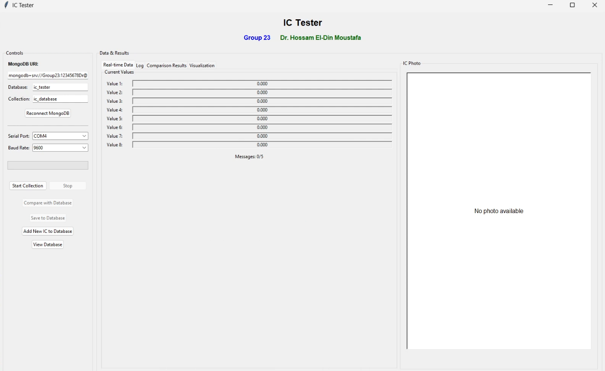

# MongoDB IC Tester GUI

A **portable IC testing GUI** built in Python using **Tkinter**, **Matplotlib**, and **MongoDB**.  
This tool collects analog IC readings from a serial device, computes averages, compares them to a database of ICs, and provides visualizations. Perfect for electronics labs or research teams.

---

## 🛠️ Features

- **Serial Data Collection**
  - Reads IC measurements over a serial port.
  - Collects multiple messages per IC for averaging.
- **Database Integration**
  - Connects to MongoDB Atlas or local MongoDB.
  - Stores IC readings, metadata, and optional photos.
  - Supports adding, updating, viewing, and deleting IC entries.
- **Real-Time Visualization**
  - Plots collected values using Matplotlib.
  - Shows average values alongside all messages.
  - Compares measurements to the best match in the database.
- **IC Photo Display**
  - Displays the stored IC photo when selected from results.
  - Supports manual photo upload during IC entry.
- **Interactive GUI**
  - Tabs for **Real-Time Data**, **Logs**, **Comparison Results**, and **Visualization**.
  - Progress bars and live status updates.
  - Buttons to start/stop collection, save results, and compare ICs.


---

## ⚡ Requirements

- Python 3.10+
- MongoDB Atlas or local MongoDB
- Python packages:

```bash
pip install pyserial matplotlib pillow pymongo numpy
````

---

## 🚀 Getting Started

1. **Clone the repository**

```bash
git clone https://github.com/yourusername/MongoDB-IC-Tester.git
cd MongoDB-IC-Tester
```

2. **Install dependencies**

```bash
pip install -r requirements.txt
```

3. **Run the application**

```bash
python ic_tester.py
```

4. **Connect to MongoDB**

   * Set your MongoDB URI, database, and collection.
   * Click **Reconnect MongoDB**.

5. **Set Serial Port**

   * Choose the correct **COM port** and **Baud rate**.
   * Click **Start Collection** to begin reading IC data.

6. **Compare & Save**

   * After collecting 5 messages, click **Compare with Database**.
   * Optionally **Save to Database** or add new ICs manually.

---

## 🖼️ GUI Screenshot

Here’s what the IC Tester GUI looks like:



---

## 📄 IC Schematic

The IC testing schematic (optional PDF) can be viewed here:

[IC Tester Schematic](images/IC_Tester_Schematic.pdf)

---

## 📊 How It Works

1. **Data Collection**

   * Reads 8 values per message.
   * Collects 5 messages for averaging.
2. **Average Computation**

   * Calculates the mean value for each of the 8 channels.
3. **Comparison**

   * Fetches all ICs in MongoDB with readings.
   * Computes **Sum of Squared Errors (SSE)** between measured and stored ICs.
   * Shows best match and similarity percentage.
4. **Visualization**

   * Plots all messages, average readings, and best-matching IC.
5. **Database Operations**

   * Add/update IC entries with readings and optional photo.
   * View/delete ICs via GUI.

---

## ⚙️ Customization & Updates

* **Extendable Serial Ports**: Add more COM ports if needed.
* **Enhanced Visualization**: Add more charts or export plots.
* **Machine Learning**: Add pattern recognition for automatic IC classification.
* **Multiple IC Types**: Support multi-type ICs with different channel counts.

---

## 🧑‍💻 Contributors

* **Fares Farrag**
* **Gasser Mohamed**
* **Ahmed Mahfouz**
* **Ahmed Hossam**

**Supervisor:** Dr. Hossam El-Din Moustafa


Do you want me to do that next?
```
